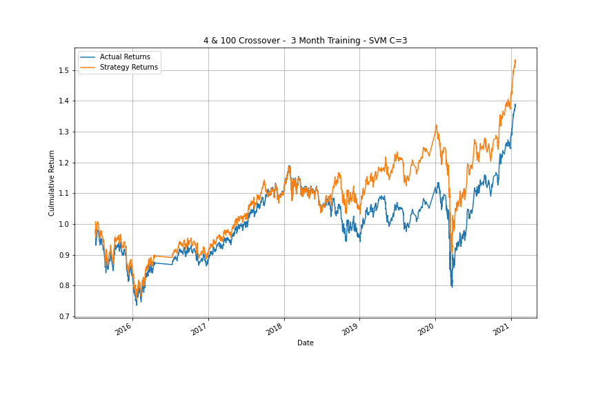

# Module 14 Challenge
## Pete Petersen
05/06/2022

### Answer the following question: What impact resulted from increasing or decreasing the training window?

The strategy culmulative performance was reduced from 153% to 131% when the training window was increased to 36 months.  The baseline model was too sensitive to handle long term trends.

### Answer the following question: What impact resulted from increasing or decreasing either or both of the SMA windows?

Ultimately, I chose to make the short window a little less sensitive by on increasing the moving average from 4 to 5 to achieve 
174%. I also increased the averages to the 50/200, but the that decresead performance to 131%.

Overall, the SVM fails to predict the sell signal when it has learned much of the weight from the major uptrend in the data.  For that reason I modified the C parameter to 3 to force the algorithm to weight the data more. I belive the data in the markets is incredibky noisy and these short term strategy should weight the data more than the regularization. With this hyperparameter change I was able to create appropriate selling behavior during the extreme uptrend while allowing the algorithm to capitalize early on March 2020 market selloff.  Because the strategy was able to buy early during the selloff rather than waiting for new momemntum we were able to generate material outperformance.

## The unlearned strategy Culm Return was 0.639679

## 1  Baseline SVM Strategy 3 month training  -  Culm Ret 1.530086

  

## 2  SVM with 36 month training - Culm Ret 1.319838

  

## 4 SVM with 5/100 DMAC and 36 month training - Culm Ret 1.746931

  

## 5 Logistic Regression 36 month - Culm Ret 1.488508

  

